# Bottle studio  
  
Mega responsiveness required  
—  
Remove the cm option only keep mm  
—  
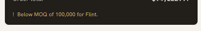  
Have this message show much more aggressively and in red  
—  
Add the teaser directly when on the first page of the form  
—  
Landing Page Request Quote which lead to  for the Bottle Studio Configurator  
The first page of the form should be:  
Option 1:  
Welcome to the Rockwood Bottle Configurator. Create a custom glass bottle in minutes, then let our engineers transform your concept into a fully manufacturable design.  
  
Start with a few simple choices. Next, refine your bottle using our live design tool. Once you're happy, we'll hand your concept to our packaging engineers.  
Opiotn two: send us an email  
  
The background should be a teaser of the bottle studio  
TEASER FOR MOBILE SHOULD BE LIKE THIS, because we want the price to appear also:  
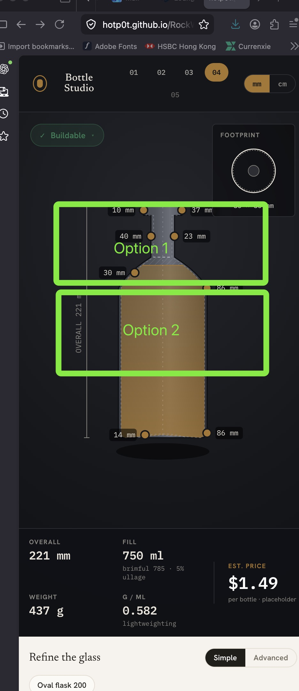  
—  
Issue here:  
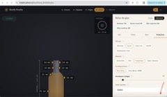  
—  
Remove all standard finish choices here:  
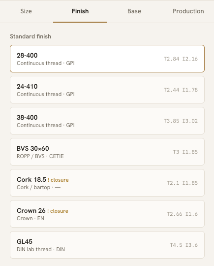  
—  
Below the bottle, add a very visible text that specifies:  
WARNING, this is an estimate +/- 10%  
—  
We can remove the advanced option, only the simple will suffice  
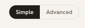  
—  
Remove the option to unlock  
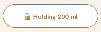  
—  
On the step of sending the estimate:  
When I click on email estimate to sales I want to send the user a PDF of the quote + a PDF of the company (details to be determined)  
—   
Every warning and messages I give to the user must be in Red  
—  
Make sure that every time I go a step back its taken into account into the rest of the workflow  
For example changing the capacity  
—  
Remove the   
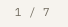  
And add them to the main list directly  
—  
Make sure that the capacity is exp no matter the changes, for now it is not strict enough and the filling of the bottle seems weird some times  
  
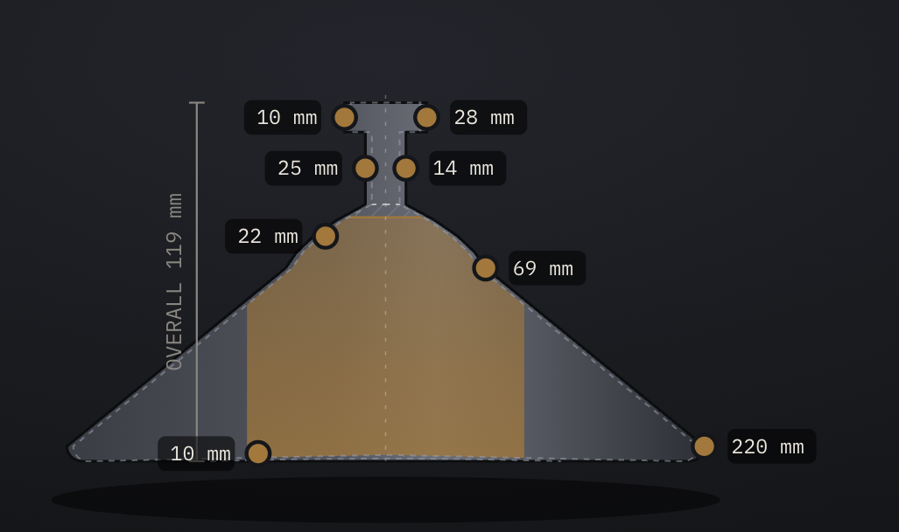  
—  
Change this location and change to red, put it dbelow the bottle for better visibility  
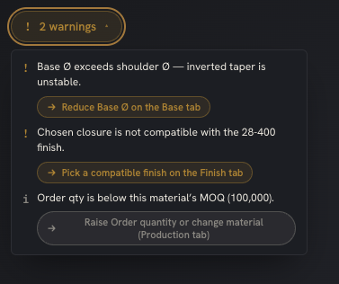  
Make it more visible  
  
If I validate with warnings still present, I want the warnings to still show when I send my estimate etc…  
—  
Remove Finish and Production  
Only keep Siz and base and merge into one single page rather than 2 tabs  
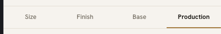  
When I arrive at step 5 (will be step 6) I choose the glass and quantity  
—  
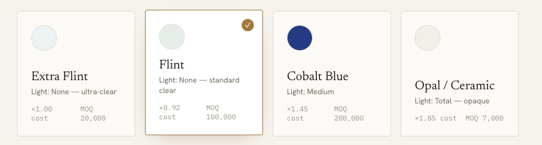  
Remove the x1.00 x0.92 x1.85 cost line for each of them  
—  
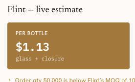  
Remove the + closure, we only do the glass  
And we change the word glass to bottle  
—  
  
  
